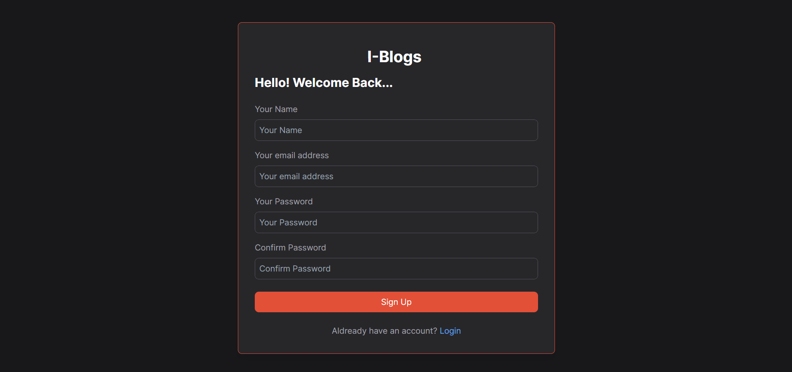
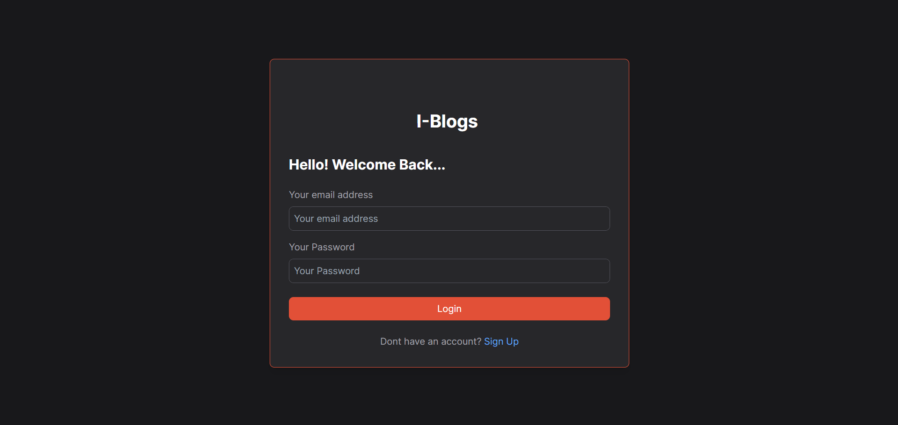
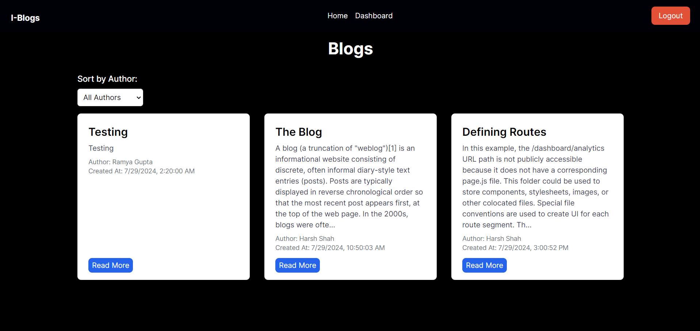
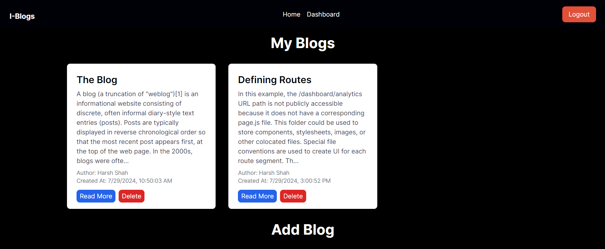
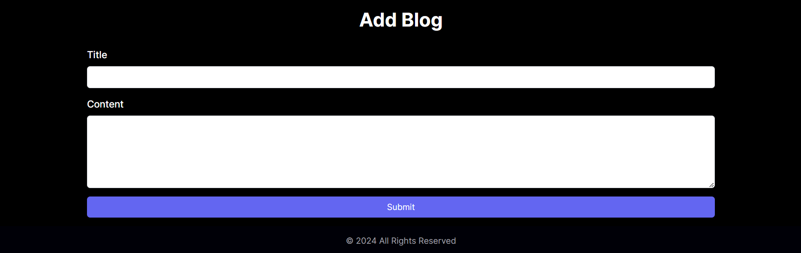

## Overview

This repository contains the codebase for the personal blog platform developed as part of the task. The platform allows users to sign up, log in, and post blog posts. Users can view all posts and filter them by author. The backend is built using Node.js and Express, while the frontend uses Next.js 14 with TypeScript.
 
## Task Description

Develop a personal blog platform where users can sign up, log in, and post articles. The platform should allow users to view all posts and filter them by author. The backend should be built using Node.js and Express, and the frontend should use Next.js 14 with TypeScript.

## Technologies Used

#### Frontend

- **Language:** TypeScript
- **Framework:** Next.js
- **CSS Framework:** Tailwind CSS

#### Backend

- **Language:** Typescript
- **Web Framework:** Express
- **ORM:** Mongoose
- **Databases:** MongoDB (main database)

## Usage

To utilize the Attack Capital personal blog website, follow these steps:

#### - Clone the Repository

```bash
git clone https://github.com/devHarshShah/blog-frontend
git clone https://github.com/devHarshShah/blog-backend
```
# Web Interface (Frontend)

## Running the Frontend

To run the Attack Capital frontend, follow these steps:

1. Open a terminal and navigate to the root directory of the frontend.

2. Run the following commands:

    ```bash
    npm install
    npm run build
    npm run start
    ```

5. The application will be accessible at `http://localhost:3000` by default.

## Screenshots

*Sign Up*



*Login*



*Home page view*



*Dashboard view*



*Create Post view*



Best Regards,
Harsh Shah